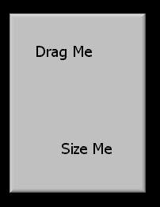



## Bevel Me User Control

### Description

Add this control to a form in design time and at runtime the form becomes borderless, with a settable bevelled edge width - you can still size and drag the form! Great for Tool Windows.
 
### More Info
 

             |
---                |---
**Submitted On**   |2001-10-09 19:53:40
**By**             |[Tony Neilsen](https://github.com/Planet-Source-Code/PSCIndex/blob/master/ByAuthor/tony-neilsen.md)
**Level**          |Intermediate
**User Rating**    |5.0 (10 globes from 2 users)
**Compatibility**  |VB 6\.0
**Category**       |[OLE/ COM/ DCOM/ Active\-X](https://github.com/Planet-Source-Code/PSCIndex/blob/master/ByCategory/ole-com-dcom-active-x__1-29.md)
**World**          |[Visual Basic](https://github.com/Planet-Source-Code/PSCIndex/blob/master/ByWorld/visual-basic.md)
**Archive File**   |[Bevel Me U280771092001\.zip](https://github.com/Planet-Source-Code/tony-neilsen-bevel-me-user-control__1-27933/archive/master.zip)

